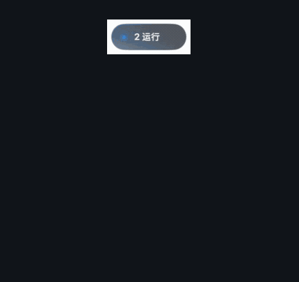
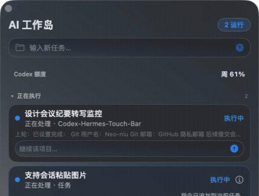

<div align="center">

# AI 工作岛

**把 Codex 会话、本地自动化和关键提醒，收进一个常驻 macOS 桌面的 AI 工作入口。**

[](#安装)
[](Package.swift)
[](LICENSE)
[](https://github.com/Neo-niu/ai-work-island/releases/latest)

[下载安装](#安装) · [产品能力](#产品能力) · [自动化接入](#自动化接入) · [隐私边界](#隐私边界)


</div>

## 它解决什么问题

AI 任务经常在后台运行：你需要反复切回 Codex 看进度，也容易错过已完成、待确认或异常的任务。AI 工作岛把这些状态汇总到桌面，并允许你直接新建任务或继续对应会话。

| 原本的工作方式 | 使用 AI 工作岛 |
| --- | --- |
| 反复切换窗口确认任务是否结束 | 胶囊持续展示运行、待读和异常状态 |
| 完成结果散落在不同会话和自动化中 | 统一按“等待你 / 正在执行 / 最近完成”组织 |
| 找到会话后再输入下一步 | 在任务卡内直接继续对应 Codex 会话 |
| 自动化各自维护状态页面 | 通过一个轻量 JSON 协议接入同一工作台 |

## 工作方式

1. **开始任务**：从面板顶部新建 Codex 会话，也可粘贴图片。
2. **后台执行**：工作岛汇总真实状态与阶段进度；没有明确计划时不虚构百分比。
3. **及时接手**：任务完成、需要确认或出现异常时进入“等待你”，可直接跳回对应会话继续处理。

## 动画演示

<table>
  <tr>
    <td width="50%" align="center">
      <br>
      <strong>悬浮胶囊</strong><br>
      悬停展开、移开回缩；重要状态优先展示。
    </td>
    <td width="50%" align="center">
      <br>
      <strong>任务中枢</strong><br>
      集中查看进行中任务、上轮结果和后续输入。
    </td>
  </tr>
</table>

> 动效会遵守 macOS“减少动态效果”设置。Touch Bar 是可选入口，没有 Touch Bar 也可完整使用桌面面板与悬浮胶囊。

## 产品能力

### 桌面任务中枢

- 统一展示 Codex 会话、未读结果和本地自动化。
- “等待你”固定优先，异常与失联不会被普通任务淹没。
- 清爽 / 详细两种信息密度，窗口尺寸和位置可持久化。
- 明确计划可显示真实步骤进度；否则只展示最新动态。

### 会话与输入

- 从顶部输入框创建新任务，并记住项目目录。
- 在每张任务卡中续接其稳定 thread ID，避免串到其他会话。
- 支持 `Command-V` 粘贴图片，也支持仅发送图片。
- 展示最近动作与上轮结果摘要；完整上下文仍保留在 Codex。

### 状态胶囊

- 悬停展开面板，移开后自动回缩；拖到屏幕边缘可自动贴边。
- 轮播任务状态、公司额度以及可用的 Codex 额度。
- 待确认、异常、失联和录音状态会锁定展示，不被普通轮播覆盖。
- 录音中显示实时音量波形，持续静音时提醒，但绝不自动停止或删除录音。
- 录音胶囊提供红色停止按钮，可直接结束并保留当前录音。
- 菜单可开启“静默运行（开会 / 投屏）”，后台任务照常执行，但不自动展开或发送录音静音提醒。
- 外观可选跟随系统、浅色或深色，并记住选择。

### 自动化与会议纪要

- 本地自动化通过 JSON 状态协议接入，无需依赖工作岛内部实现。
- 支持 `running`、`queued`、`waiting`、`failed`、`completed`、`idle`、`stale`。
- 可展示阶段、产出路径、打开链接与失联策略。
- 会议纪要可呈现转写、生成、写入 Obsidian 与推送排队状态，不读取正文。

## 安装

### 普通用户

1. 从 [GitHub Releases](https://github.com/Neo-niu/ai-work-island/releases/latest) 下载 `AI-Work-Island.app.zip`。
2. 解压后将“AI 工作岛”拖入“应用程序”，然后打开。
3. 若首次启动被 macOS 拦截，在“系统设置 → 隐私与安全性”中选择“仍要打开”。
4. 使用录音守护时，按系统提示授予麦克风与辅助功能权限。

需要 macOS 13 或更高版本。

### 从源码构建

需要 Xcode Command Line Tools：

```bash
git clone https://github.com/Neo-niu/ai-work-island.git
cd ai-work-island
./script/build_and_run.sh --verify
```

构建产物位于 `dist/AI 工作岛.app`，验证流程会同时安装到 `/Applications/AI 工作岛.app`。

## 自动化接入

每个任务原子写入一个 JSON 文件到：

```text
~/Library/Application Support/Codex Hermes Touch Bar/automation-status/
```

最小示例：

```json
{
  "id": "daily-report",
  "title": "生成日报",
  "source": "本地自动化",
  "status": "running",
  "detail": "正在汇总数据",
  "updatedAt": "2026-08-13T06:30:00Z"
}
```

也可提供阶段进度、产出路径、打开链接与自定义失效时间。完整字段见 [状态示例](examples/automation-status.example.json)。

## 公司额度配置

每位使用者需要在自己的 Mac 上完成一次配置：

1. 使用 Microsoft Edge 登录公司模型平台 `https://model.zhenguanyu.com/`。
2. 保留一个已登录的平台标签页。
3. 工作岛会通过该页面的同源请求读取当前用户额度。

工作岛不读取或保存 Cookie。最近一次成功额度会持久化供标签页休眠或应用重启后展示；后台读取失败时会唤醒并刷新对应 Edge 标签页后重试。未配置时显示“公司额度待配置”；没有 Codex 账号也不影响公司额度展示。

## 隐私边界

| 数据 | 处理方式 |
| --- | --- |
| Codex 状态 | 只读本机索引与 rollout，不额外保存对话正文 |
| Token / Cookie | 不读取、不持久化 |
| 粘贴图片 | 仅暂存于系统临时目录，发送或删除后清理 |
| 会议纪要 | 只读阶段、会议名、队列数和输出路径，不读取正文 |
| 录音音量 | 仅在内存中判断，不保存、不上传 |

## 已知限制

- Touch Bar 常驻依赖 macOS 私有 API，系统升级可能影响兼容性。
- 无 Developer ID 时使用 ad-hoc 签名，重建后 macOS 可能重新请求辅助功能权限。
- 公司额度依赖 Edge 中已登录的平台页面。
- Codex 额度是可选信息，只在本机读到有效数据时显示。
- 浮窗用于状态与快速续接，不承载完整多轮消息记录。

## 开发验证

```bash
swift test --disable-sandbox --scratch-path /tmp/codex-hermes-touch-bar-tests
./script/build_and_run.sh --verify
dist/AI\ 工作岛.app/Contents/MacOS/CodexTouchBar --diagnose-automation
```

项目源自 MIT 项目 [MarlonJD/codex_touchbar](https://github.com/MarlonJD/codex_touchbar)，并保留原许可证。
